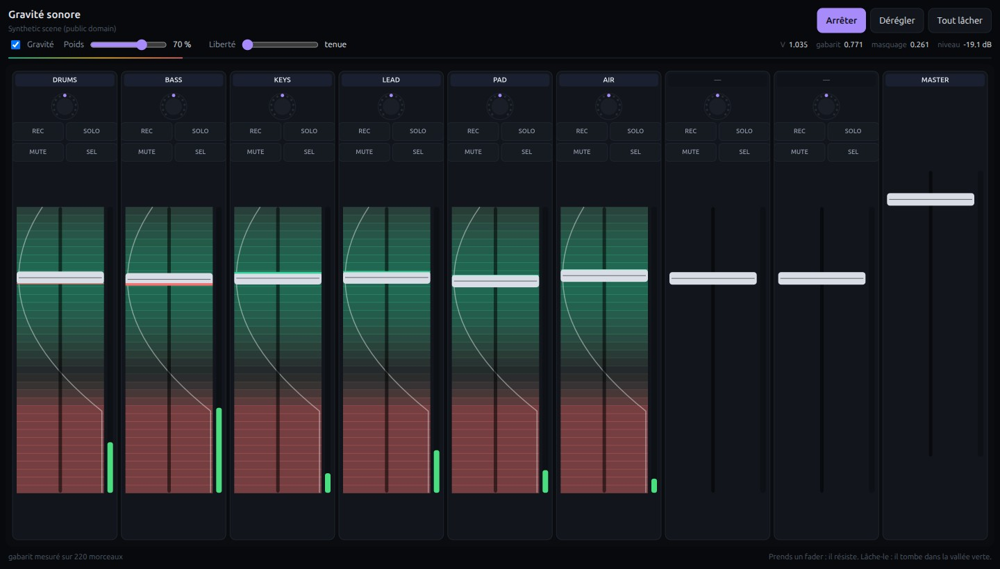
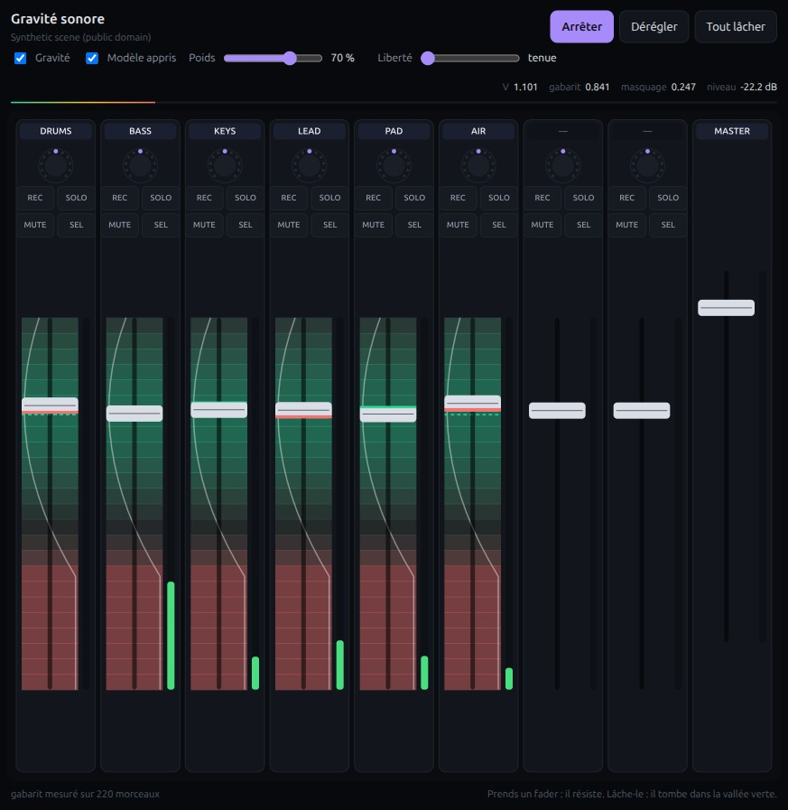

# Sonic Gravity

**A mixing console whose motorised faders push back when your hand moves toward a
bad mix, and slide into place on their own when you let go.**

Not a music generator. An *exoskeleton for the mixing engineer's hand*: the
machine never decides the mix, it makes the shape of the problem physically
felt.

Target hardware is a **Behringer X-Touch** (9 motorised faders, MCU protocol).
Until that hardware arrives, the surface is reproduced on screen behind
**exactly the same API**, so swapping in the real console replaces one file and
nothing else.



The gradient behind each fader is the gravity field: green is a valley, red is a
hill, and the white curve is the potential along the fader's travel. You can see
where the fader will settle before you release it.

---

## Why this is not a gadget

Today's AI music tools are *generative and remote*: type a prompt, wait, receive
a finished file. Nothing about that is real-time, embodied, or under continuous
control.

This is the opposite problem, and it is the one that matters for physical
systems:

- **Continuous, noisy signals** rather than discrete tokens.
- **Closed loop** at 60 Hz: measurement → prediction → force → actuator →
  measurement.
- **Action-conditioned prediction.** The whole system rests on answering *"what
  would happen if I pushed this fader?"* **without pushing it.** You cannot
  measure that live across nine faders — you would have to move each one and
  listen. That question is exactly what an action-conditioned world model
  exists to answer.

## Run it

```bash
pip install -r requirements.txt
python -m sonic_gravity.make_demo_scene   # synthesises a royalty-free 6-track scene
python -m sonic_gravity.serve             # → http://127.0.0.1:8700
```

The trained model ships with the repository; tick **Modèle appris** to swap the
analytic field for it. To retrain from your own separated stems:

```bash
pip install torch
python -m sonic_gravity.dataset --decompositions /path/to/stems
python -m sonic_gravity.train
```

Then: **Écouter** (play), **Dérégler** (scramble), **Tout lâcher** (release all).
The faders fall back into the valley. Grab one with the mouse and it lags behind
your finger, on the side the field is pushing. On a phone, the Vibration API
turns that lag into something you can feel.

To run the field on your own separated stems instead:

```bash
python -m sonic_gravity.prepare_demo --decompositions /path/to/stems --list
python -m sonic_gravity.prepare_demo <id>
```

## How it works

```
audio → pre-fader spectra → field → force → motors → faders → audio
```

Every channel is measured **pre-fader**: `P[i,b]` is the power of channel `i` in
band `b`, independent of its gain. The mix is then

```
M[b] = Σᵢ (gᵢ·aᵢ)^(2p) · P[i,b]        p = spec.faderExponent (2, i.e. amplitude ∝ g²)
```

which makes the potential **analytically differentiable** with respect to the
faders. The force sent to each motor is `−∂V/∂gᵢ`, computed in closed form.

⚠️ `p` lives in `spec.json` and nowhere else. The audio engine and the field
once disagreed about it — the engine applied `g²` to amplitude (so `g⁴` in
power) while the field assumed `g²` in power, and a comment claimed they
matched. The field was describing a mix nobody was hearing, with no error and
no failing test. A shared constant plus a guard test now prevent it.

### The potential

| Term | What it measures | Why it is shaped that way |
|---|---|---|
| `tilt` | Distance to the spectral profile of real records, as a per-band z-score, through a **Huber loss** | The profile is **measured** on 220 tracks, not postulated. Huber stops a quiet passage from dominating the field |
| `mask` | Masking between channels (histogram intersection of spectral shapes, weighted by energy) | **Scale-invariant**, so its gradient says "lower the one that is fighting", never "lower everything" |
| `level` | Distance to a target level, **deliberately low weight** | Level is the master fader's job, not the channels'. At high weight the optimum ran into the top end stop |
| `anchor` | Pull back toward where the hand last left the fader | This is what separates an exoskeleton from an autopilot. A "Liberté" slider releases it and hands the whole mix to the machine |

Each band is additionally weighted by the **material actually available**:
during a passage where only one instrument plays, no fader can produce low end
that nobody is playing, so those bands stop counting. That weighting is measured
at full gain, so it is constant with respect to differentiation and leaves the
gradient's form untouched.

### Does it work?

Six scramble-then-release trials, each scored **on the same audio frame** so the
music cannot drift and flatter the result:

| | scrambled | after gravity |
|---|---|---|
| potential `V` | 12.3 – 17.1 | 1.19 – 1.94 |
| mix term only (anchor removed) | 1.43 – 2.67 | 1.16 – 1.91 |
| fader spread | 0.53 – 0.73 | 0.02 – 0.05 |

**6 / 6 improved**, including with the anchor term removed — so it is the mix
itself that gets better, not merely the faders returning home.

A sharper test: the synthetic demo scene contains two deliberate defects — `keys`
and `lead` occupy the same midrange and fight, and the pad is mixed too loud.
Released with the anchor at zero, the field **muted `keys` and `pad`** and kept
the other four. It found both planted faults on its own.

Measured live in the browser: **60 fps**, force + gradient in **1 µs**, all six
field reliefs (216 potential evaluations) in **0.13 ms** — under 1 % of a frame
budget.


## The learned world model

The analytic field is closed-form and exact about the wrong thing: it assumes
decorrelated phases. On real summed audio it is off by **0.58 dB** on average
(p95 1.74 dB), and the error is not spread evenly — it concentrates in bands
10-15, roughly **250-500 Hz**, which is where separated stems bleed into each
other and where mixing decisions are actually made.

So there is something to learn, and it sits exactly where it matters.

### What it does

`log M̂ = log M_analytic + Δ(P, g)` — a residual, not a replacement. The network
starts with its output layer zeroed, so an untrained model *is* the analytic
field, and training can only earn its way away from it. Deep sets over channels
(per-channel encoder → mean pool → decoder), so it is permutation-invariant and
works with 4 stems or 9 without retraining.

**Mean pooling was chosen over max for a runtime reason**: its backward pass is
a division rather than a gather, which keeps the hand-written JavaScript
gradient short enough to be obviously correct. The gradient is the product
here, not a by-product — an architecture that is awkward to differentiate in a
browser is the wrong architecture, however good it looks in Python.

### Results, on tracks it never saw

| | MAE |
|---|---|
| analytic baseline | 0.4938 dB |
| baseline + per-band constant (**the fair reference**) | 0.4630 dB |
| **ablated model** — per-channel pathway blanked | 0.4626 dB |
| **full model** | **0.4379 dB** |

**5.4 % better than the fair reference** (t = 8.9 over 2464 samples,
ahead on 64 % of them), from 29,156 parameters.

Three guardrails make that number mean something:

- **Splits are by track, never by sample.** Windows from one song share
  instrumentation and bleed; splitting by sample would put near-duplicates on
  both sides.
- **The reference is bias-corrected.** The baseline has a systematic per-band
  offset. A model that learned only that constant would still "beat" the raw
  baseline, so the constant is granted to the baseline first.
- **An ablation, not a permutation.** Blanking the per-channel pathway leaves a
  model that gains **+0.0004 dB** — nothing. All of the improvement is
  conditional on which channels play and where their faders sit.

⚠️ Two permutation controls were tried first and **both were invalid**.
Shuffling targets reported a +2.39 dB "improvement"; re-pairing inputs within
each split reported +2.19 dB. Neither was a warning about the model. The
baseline here is a *fixed formula*, not a fitted predictor: break the relation
and it stays structured but decorrelated, while a network simply retreats to
the target mean and wins trivially. The two error scales were never
commensurable. A control has to remove the information being tested while
leaving both predictors on the same problem — which is an ablation.



### In the browser

The forward *and backward* passes are written by hand in `learned.js`, checked
against PyTorch autograd to 1e-5 (`tests/test_learned_parity.py`), and the
assembled field — network, level, masking, anchor — is checked against finite
differences of the potential the console actually reads, with the model on and
off. Wiring a network into the middle of a gradient is where forgotten paths
live, and they never announce themselves: the console keeps working and pulls
slightly wrong.

Cost, measured live:

| | median frame | p95 | worst |
|---|---|---|---|
| analytic | 1.9 ms | 2.1 ms | 3.8 ms |
| learned | 3.4 ms | 3.7 ms | 6.4 ms |

60 fps either way. The field reliefs are computed **one channel per frame** in
rotation rather than all at once: with the model in the chain the six of them
cost 12 ms together, three quarters of a frame, which showed up as a stutter at
every refresh. Spread out, each frame carries a sixth of it for the same
perceived freshness.

### Why no VICReg, no EMA target

JEPA-style training needs collapse prevention because encoder *and* target are
learned together, so both can degenerate to a constant. Here the target is a
**measured spectrum** — fixed. There is nothing to collapse into, and adding
that machinery would be cargo cult. It becomes necessary the moment the target
itself is learned, which is what modelling compressor dynamics through time
would require.


## Adding memory: does the past actually help?

The model above is per-frame. Compression, pumping — anything depending on the
recent past — is invisible to it. So: give the world a memory, give the model a
memory, and measure whether that buys anything.

**The world gets a bus compressor** (`bus.py`). Gain reduction depends on what
the signal did milliseconds ago, so the same fader position sounds different
depending on how it was reached, and lowering one channel changes the reduction
— hence every other channel's contribution. The faders stop being independent.

**The model gets a GRU** whose hidden state carries what the bus is doing.
Everything else is unchanged. The claim is tested against *the same network with
its state re-zeroed every frame*: identical parameters, identical capacity, no
access to the past. Comparing against the analytic baseline instead would let
extra capacity pass for temporal modelling.

### Result

Six initialisation seeds on a fixed track split:

| | MAE |
|---|---|
| analytic | 2.9948 dB |
| memoryless | 1.5727 dB — +1.4221 from learning |
| **recurrent** | **1.4526 dB** — **+0.1201 from memory** |

Per-seed memory gain: +0.140, +0.132, +0.085, +0.158, +0.103, +0.103 dB
→ **+0.1201 ± 0.0113 dB (SE), t = 10.7**, 6/6 seeds positive.

Memory is worth **7.6 %** on top of what learning already bought.

### Four things that had to be fixed before that number appeared

Every one of them produced a *negative* result first, and each looked like
"memory doesn't help" rather than "the experiment is wrong":

1. **The analysis window was longer than the compressor's release** (186 ms vs
   150 ms). The bus state was fully observable in the current frame, so there
   was nothing to remember. A system is only worth a recurrent model where it is
   *partially* observable at the observation scale.
2. **Truncated BPTT started from a zeroed state mid-sequence.** The model was
   trained to cope with a state that was simply wrong, which *penalised* having
   memory at all (recurrent worse than memoryless, t = −16.5). Fixed with a
   warm-up window excluded from the loss.
3. **A wideband compressor moves the LEVEL, not the shape** — measured: −18 dB
   of level against 0.157 dB of shape. The potential consumes only the shape, so
   the effect being hunted was six times smaller than the model's own error. A
   three-band bus changes the shape by 2.78 dB, and each band's reduction
   follows its own history.
4. **The model never saw the absolute level.** A compressor's threshold is in
   dB, and every other input was shape-normalised. Without that one number no
   model can predict how much it reduces.

### And the trap that nearly produced a false negative

The first clean run said memory was worthless (−0.054 dB). Two other seeds said
the opposite (+0.155, +0.050). The seed controlled **both** the network
initialisation **and** the train/test split, so two sources of variance were
confounded, and the spread was larger than the effect.

Separating them — fixed split, varying initialisation — is what turned a coin
flip into +0.1201 ± 0.0113 dB. A single-seed result here, in either
direction, would have been noise reported as a finding.

### Not wired into the demo, and why

The browser's world has a wideband limiter *after* the measurement point, not a
multiband bus. Switching this model on in the demo would run a model trained on
one world inside a different one. Doing it honestly needs an AudioWorklet
mirroring `bus.py` and a hand-written GRU step in JS — the backward pass is
single-step (the hidden state is given at runtime, so no
backpropagation-through-time), which is what makes it feasible at 60 fps at all.

Until then this stands as a controlled experiment, reproducible with:

```bash
python -m sonic_gravity.dataset_seq --decompositions /path/to/stems --multiband
python -m sonic_gravity.train_seq --data sonic_gravity/data/sequences_mb.npz --seeds 6
```


## What the analytic field does *not* capture

The central approximation is `M[b] = Σ g²·P[i,b]`, i.e. **decorrelated phases**.
That holds well for separated stems; it would break on two copies of the same
signal. Compression, saturation and psychoacoustic masking are not modelled
either.

So this field is **not the ground truth — it is the baseline to beat**, and the
learned model above beats it by 5.4 % on unseen music. Shipping the baseline is
what makes that claim checkable: the model has a quantitative opponent rather
than a vibe check.

What neither model captures yet: compression and saturation (both time-varying,
which needs a recurrent latent rather than a per-frame one) and psychoacoustic
masking (the current mask term is spectral overlap, not a loudness model).

## Tests

```bash
python -m pytest tests/
```

- **43 field tests.** The gradient is checked against centred finite
  differences over 26 randomised configurations (with mutes, with anchoring, and
  across the Huber knee). This is the only proof that counts: a sign or factor
  error breaks no structural test — it just pushes the operator's hand toward
  the worse mix, silently. One such bug was caught this way: `DB_SCALE` (the
  factor in a decibel's *derivative*) written where `10` (the factor in its
  *value*) belonged, inflating every force by 1.7×–2.8×.
- **6 parity tests, Python ↔ JavaScript**, to 1e-9: potential, each term,
  gradient, and band layout. The model is trained on one implementation and
  applied in the other; a divergence would not crash anything, it would surface
  weeks later as a console that no longer matches what it learned.

Four other real defects were found by measuring rather than by looking, and each
is documented at the site of its fix:

1. A **phantom band at −174 dB** in the measured profile: at 37 Hz no FFT bin
   fell inside it. With a z-score divisor it would have buried the other 39.
2. **Faders driving into the end stops**, because the potential had no term
   representing the operator's intent.
3. **`V` exploding to 88** during a musical break — penalising the absence of
   low end that no channel was playing.
4. A **silence gate keyed to the running peak**, which at startup was
   initialised on silence itself, so the analyser noise floor read as music.

## Layout

| File | Role |
|---|---|
| `sonic_gravity/field.py` | **The core**: potential, analytic gradient, band layout |
| `sonic_gravity/web/js/field.js` | JS mirror, held in step by the parity tests |
| `sonic_gravity/spec.json` | **Single source** of constants, read by both implementations |
| `sonic_gravity/fit_target.py` | Measures the spectral profile over a music library |
| `sonic_gravity/make_demo_scene.py` | Synthesises the royalty-free demo scene |
| `sonic_gravity/prepare_demo.py` | Builds a scene from your own separated stems |
| `sonic_gravity/web/js/mix.js` | Web Audio: stems → pre-fader analysers → bus, silence gate |
| `sonic_gravity/web/js/motor.js` | Motorised-fader physics + haptics |
| `sonic_gravity/web/js/surface.js` | The on-screen X-Touch — same API as the MCU driver |
| `sonic_gravity/web/js/app.js` | The closed loop |
| `sonic_gravity/dataset.py` | Renders real summed audio at randomised fader positions; reports the baseline's error |
| `sonic_gravity/model.py` | The residual deep-sets model (PyTorch, training only) |
| `sonic_gravity/train.py` | Training with track-level splits, bias-corrected reference, ablation control |
| `sonic_gravity/web/js/learned.js` | The model at runtime — forward and backward by hand |
| `sonic_gravity/bus.py` | Bus compressor, wideband and multiband — what gives the world a memory |
| `sonic_gravity/dataset_seq.py` | Fader trajectories through a compressed bus |
| `sonic_gravity/train_seq.py` | Recurrent vs memoryless, averaged over seeds on a fixed split |

## Moving to hardware

`surface.js` exposes `setFader` · `setMeter` · `setVpotRing` · `setMuteLed` … and
emits `{type:"fader"|"mute"|"solo"|"touch"…}`: the MCU vocabulary, the same one
a Web MIDI driver uses to drive real motorised faders over pitch-bend. Attaching
the physical console is a substitution, not a rewrite.

One concept has no hardware counterpart in the other direction: the drawn gap
between finger and fader cap. On screen, resistance can only be *seen*. On the
X-Touch it is *felt* — which is the entire point, and the one thing this
on-screen demo can only approximate.

## Not done yet

- **Wiring the recurrent model into the browser.** Measured to be worth
  +0.12 dB (see above) but not shipped: it needs an AudioWorklet mirroring
  `bus.py` so the demo's world matches the one it was trained on, plus a GRU
  step in `learned.js`.
- **Latent-space prediction.** Both models decode to a *measured* spectrum, so
  there is nothing to collapse into and no VICReg is needed. Predicting in a
  learned latent instead — true JEPA — is the step where collapse prevention
  becomes necessary, and it is untried here.
- **Training on interaction traces.** `serve.py --record` captures them, but the
  current model is trained on randomised fader positions over separated stems,
  not on how a human actually moves faders.
- V-Pot rings move but are not bound to any parameter.
- The master fader is outside the field.
- On phones the button hit target is 66×36 px, below the 44 px guideline; the
  4 px gutter caps vertical growth and the width compensates.
- **Source comments are in French.** The README is not; the code has not been
  translated yet.

## License

MIT — see [LICENSE](LICENSE). The demo scene is synthesised from scratch by
`make_demo_scene.py` and contains no third-party audio.
